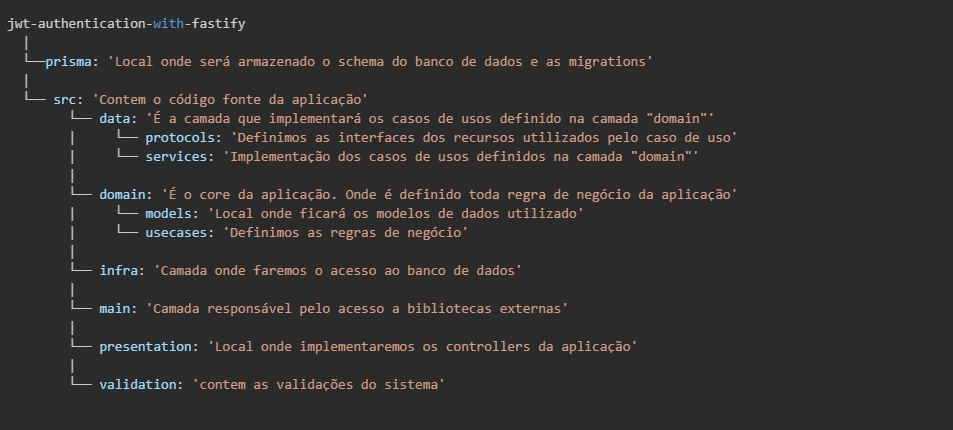
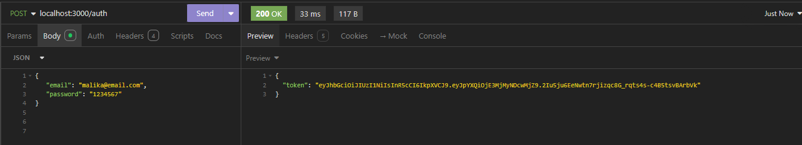
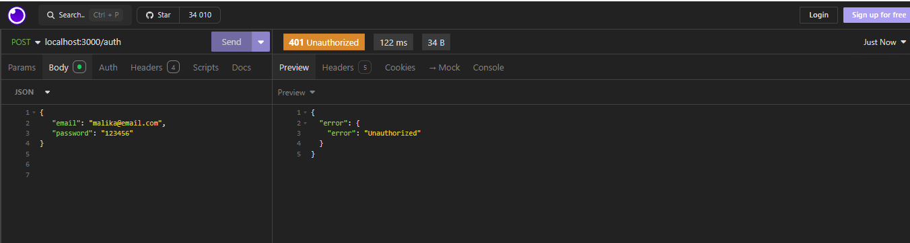

<h1 align="center">
     Autenticação com Fastify utilizando token JWT 
 </h1>
 <p align="center">
    <a href="#sobre-o-projeto">Sobre o Projeto</a> |
    <a href="#tecnologias">Tecnologias</a> | 
    <a href="#pré-requisitos">Pré-Requisitos</a> |
    <a href="#executando-a-aplicação">Executando a aplicação</a>   |
    <a href="#rotas-api">Rotas API</a> |
    <a href="#testes-utilizando-o-insomnia">Testes utilizando o INSOMNIA</a> 
</p>

## Sobre o Projeto

A autenticação de usuários é um aspecto fundamental em muitos projetos, e o uso de tokens JWT (JSON Web Tokens) é uma abordagem popular para garantir a segurança das rotas e recursos da aplicação.

Nesse projeto estarei apresentando como realizar a authenticação de usuario através de login e senha e retornar um token JWT

## Tecnologias

[]()
[]()
[]()
[]()
[]()
[]()

## Arquitetura do projeto



## Pré-Requisitos

Para rodar a aplicação, será necessário uma instancia do banco de dados PostgreSQL ou instalado o serviço do Docker

## Executando a aplicação

**Passo 01:** Faça o clone do repositorio

```
git clone https://github.com/maironvilela/jwt-authentication-with-fastify.git
```

**Passo 02:** Acesse o projeto e execute o comando `npm install` para instalar as dependencias do projeto

**Passo 03:** Renomeie o arquivo `.env example` para `.env` e defina os valores das variáveis de ambiente

- JWT_SECRET: Senha que será utilizada para gerar o token
- DATABASE_URL: URL da instancia do banco de dados PostgreSQL

> Caso nao tenha disponível o banco de dados, instale o docker na maquina e na raiz do projeto, execute o comando `docker compose up -d`que será criada uma instancia do banco de dados PostgreSQL,

**Passo 04:** Iremos utilizar o prismaORM para realizar a criação as tabelas no banco de dados

```
npx prisma migrate dev
```

**Passo 05:** Executar o servidor

```
    npm run dev
```

> Durante o processo de inicialização do servidor, será criado um usuario com as seguintes informações:  
>  "email": "malika@email.com",  
>  "password": "1234567"

**Passo 06:** Testar a aplicação através do insomnia

## Rotas API

### POST/auth

**Request**

     {
        email: string
        password: string
     }

**Response**

     {
       "token": string",
     }

## Testes utilizando o INSOMNIA

### Credenciais válidas



### Credenciais inválidas


